# Research On CT Image Recovery Based On Translation Variant Convolution

---

## Project Background

- This project is an undergraduate graduation design project, which explores the **sensitivity of structure** of **translation variant convolution (TVConv)** on CT images with **similar structural features** and studies its **CT image recovery capability**.

- Core Technology: Translation Variant Convolution (TVConv), with the following published published papers and its information👇:

  > [**TVConv: Efficient Translation Variant Convolution for Layout-aware Visual Processing**](https://arxiv.org/abs/2203.10489)      
  > Jierun Chen, Tianlang He, Weipeng Zhuo, Li Ma, Sangtae Ha, S.-H. Gary Chan        
  > *In Proceedings of the IEEE/CVF Conference on Computer Vision and Pattern Recognition (CVPR), 2022*


## Experimental Data

- **Data Source**: Annual low-dose CT competition from the Mayo Clinic 
  (but I don't know the exact year of this competition😵‍💫）

- **Data Content**: CT images with slice thicknesses of 1mm and 3mm at full and 1/4 dose.

- **Data Image Size**: 512 × 512

- ⚠️Data is not available from this project so that you need to modify the code about data input etc.

  


## Experimental Model Design

- Types of Experimental Models

  | UNet  series | UNet++ series |
  | :----------: | :-----------: |
  |     UNet     |    UNet++     |
  |   UNet_DW    |   UNet++_DW   |
  |   UNet_TV    |   UNet++_TV   |

-  Inverted Residual Block with TVConv

  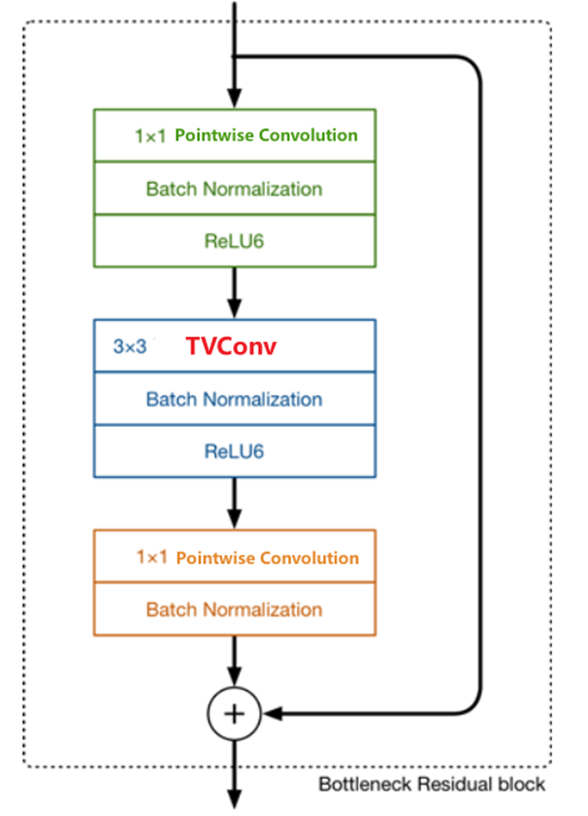

  

- Network Framework Diagrams with TVConv

  - UNet_TV

    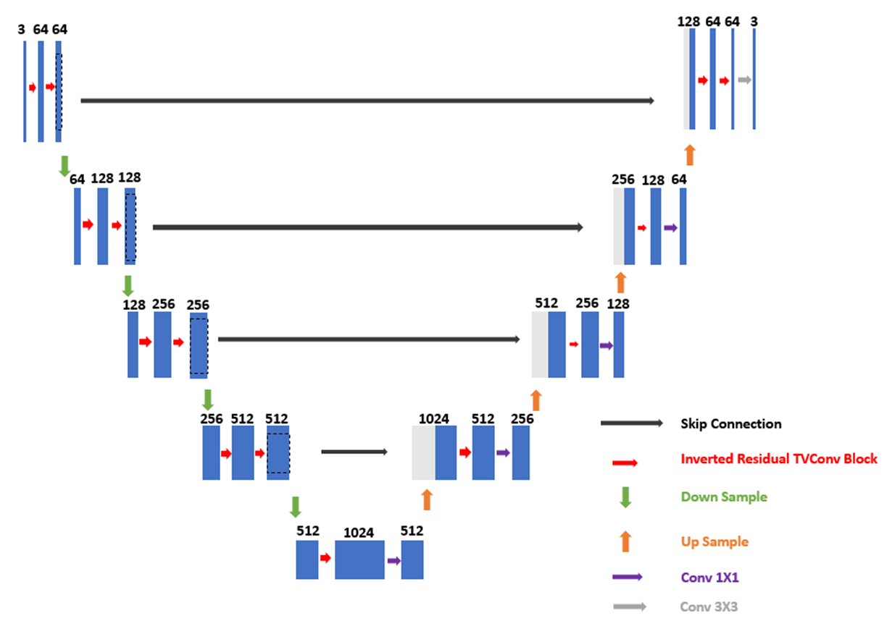

  - UNet++_TV

  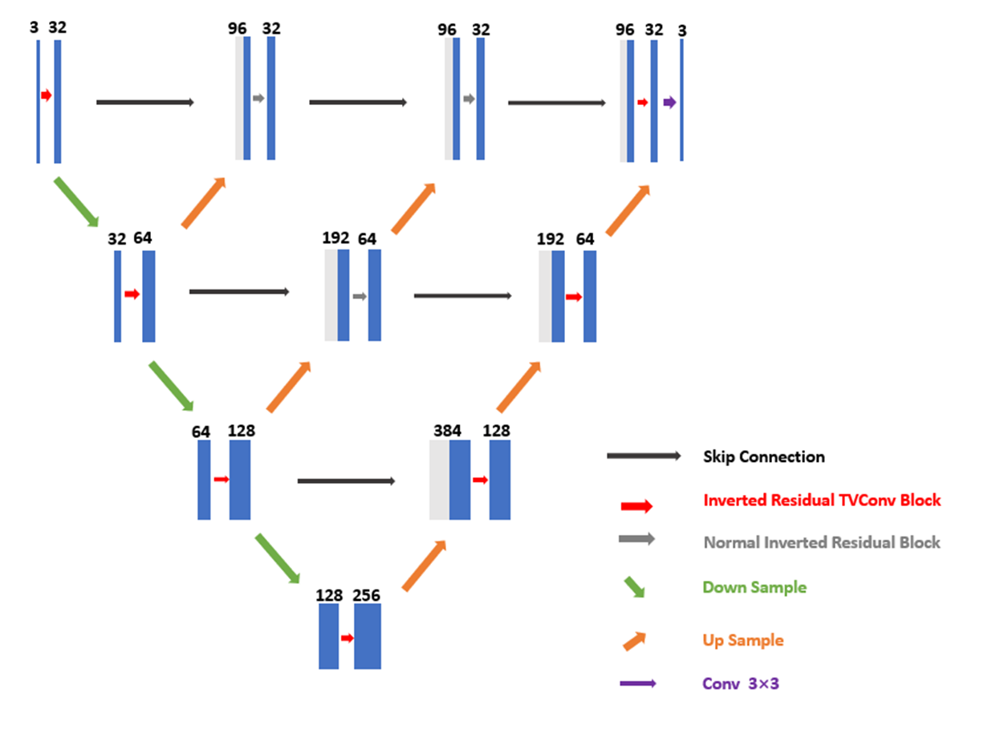


## Experimental Environment

- Hardware

  | Hardware |            Version            |
  | :------: | :---------------------------: |
  |   CPU    | Intel(R) Xeon(R) Silver 4214R |
  |  memory  |              32G              |
  |   GPU    |   NVIDIA GeForce RTX 3090Ti   |

- System

  |    System    |      Version       |
  | :----------: | :----------------: |
  | Distribution | Ubuntu 20.04.4 LTS |
  |     CUDA     |        11.4        |

- Software

  |   Software   | Version |
  | :----------: | :-----: |
  |    Python    |  3.7.1  |
  |    Torch     | 1.10.0  |
  | Torchmetrics | 0.11.4  |
  |    Numpy     |  1.3.5  |
  |    Pandas    |  1.3.5  |
  |     CV2      |  4.9.0  |

- Experimental Hyperparameter Setting

|          Parameter           |       Value/Type       |
| :--------------------------: | :----------------: |
|          Batch size          |         1          |
| Train\ Validation\test split |       8:1:1        |
|   Epoch             |        100         |
|       Learn rate          |        1e-4        |
|      Optimizer           |        ADAM        |
|        β1   β2            | β1 =0.9    β2=0.99 |
|Loss function         |        MSE         |
|     Image size          |  （256，256，1）   |


## Experimental Data Preprocessing

- Window Width and Window Level Settings

  | Window Width | Window Level |
  | :----------: | :----------: |
  |    400HU     |     40HU     |

- Similar Structure Grouping

  This experiment explores the structural sensitivity and recovery efficiency of TVConv on CT images with **similar structural features**. The experimental data will undergo **subjective visual-level structural classification**, divided into two structures named sm1 and sm2:

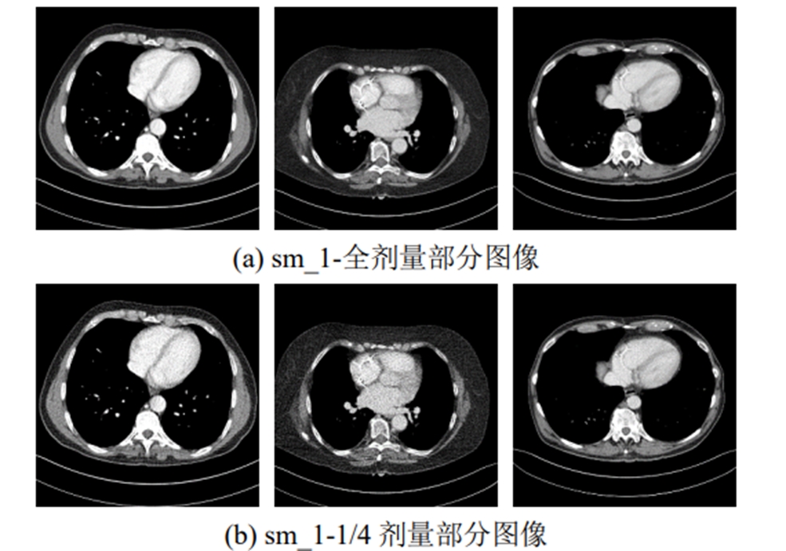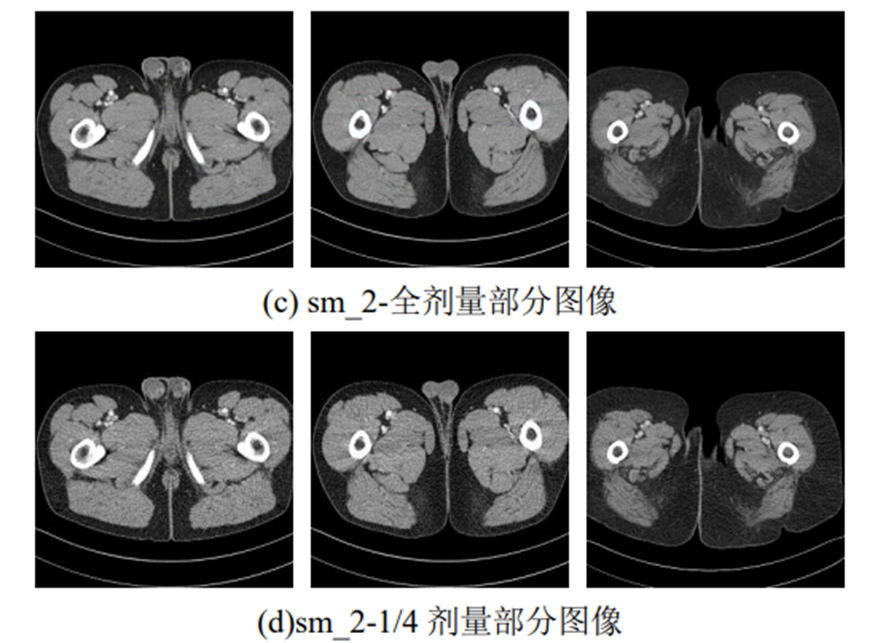


## Experimental Execution

- **Experimental Execution Programme ：ct_image_recovery.py

  ```
  Default execution command：py ct_image_recovery.py
  ```

- This project sets up argparse.ArgumentParser, allowing modifications to experimental parameters , including:

  - Device choosing
  - Dataset setting
  - Training program hyperparameters setting
  - Network model selection

  （Detailed settings can be found in the source code）

  

## Experimental Results

- 1/4 Dose Image Recovery

  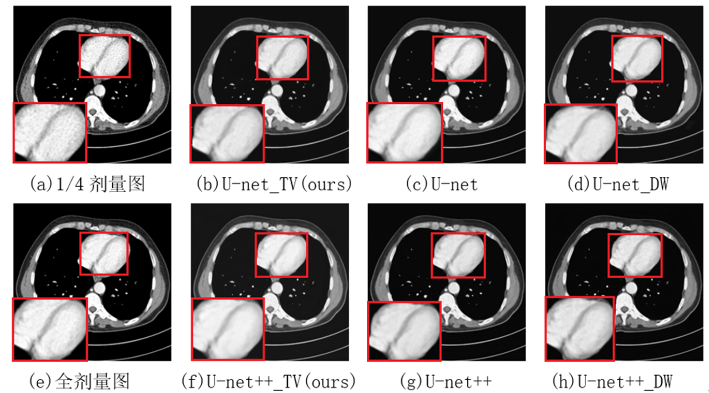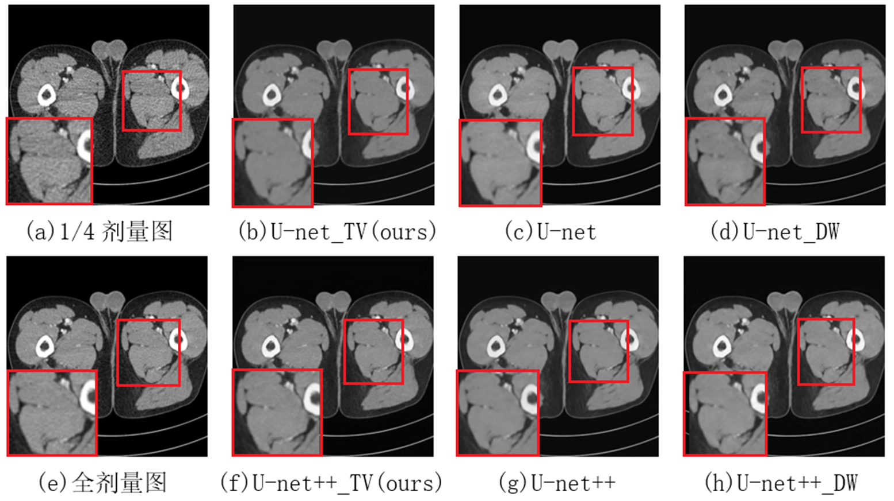

  ​                  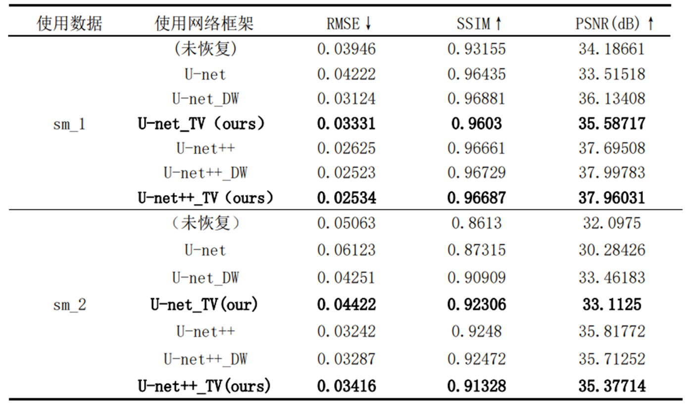


- 1/4 Dose + Quantitative Gaussian Noise Image Recovery

  - Gaussian noise setting

    | Parameters of Gaussian Nosie | Symbol | Value |
    | :--------------------------: | :----: | :---: |
    |           average            |   μ    |   0   |
    |      standard deviation      |   σ    |  50   |

  - Image comparison

    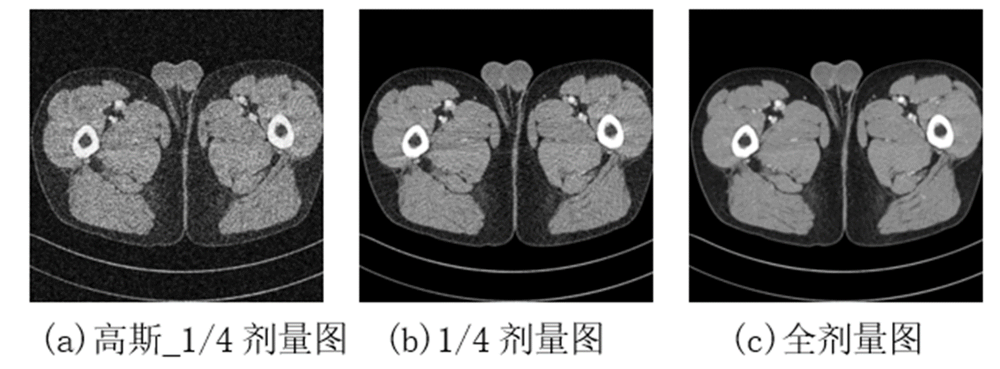

  - Experimental results

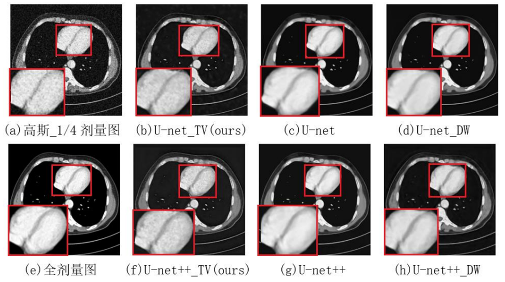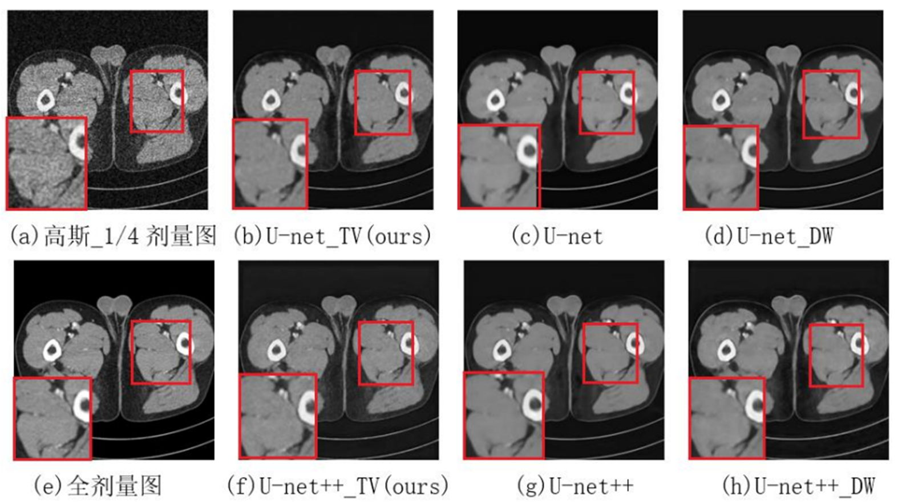

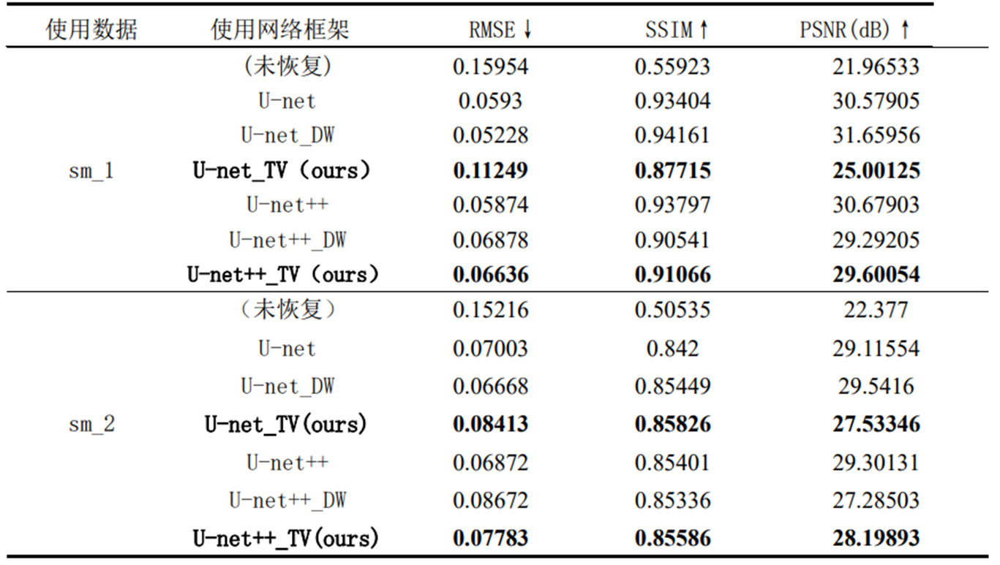


## Ablation Experiment - Feature Map Analysis of Each Layer

- 1/4 Dose Image Recovery
  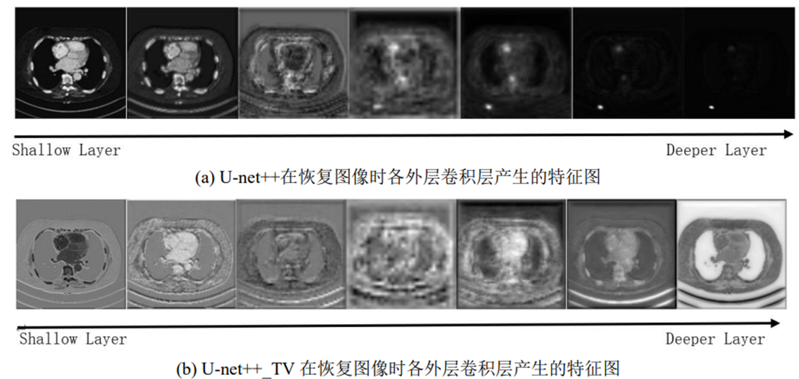

- 1/4 Dose + Quantitative Gaussian Noise Image Recovery
  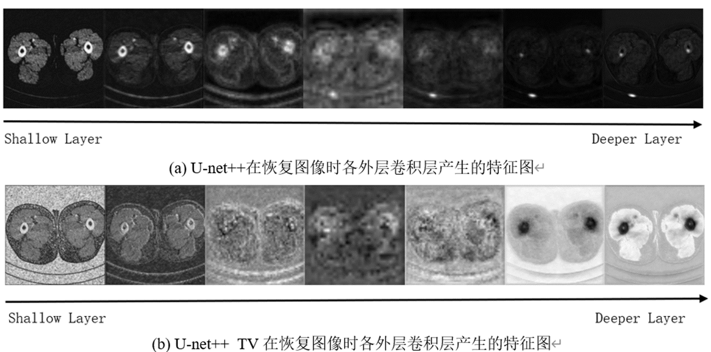


## Citing

If my work helps your project, please cite the original authors, JieRun CHEN et al.😯
Here is the GitHub link for the original author's TVConv project 👇

​	[CVPR 2022\] TVConv: Efficient Translation Variant Convolution for Layout-aware Visual Processing (github.com)](https://github.com/JierunChen/TVConv)

considering citing👇

      @InProceedings{Chen_2022_CVPR,
        author    = {Chen, Jierun and He, Tianlang and Zhuo, Weipeng and Ma, Li and Ha, Sangtae and Chan, S.-H. Gary},
        title     = {TVConv: Efficient Translation Variant Convolution for Layout-Aware Visual Processing},
        booktitle = {Proceedings of the IEEE/CVF Conference on Computer Vision and Pattern Recognition (CVPR)},
        month     = {June},
        year      = {2022},
        pages     = {12548-12558}
      }